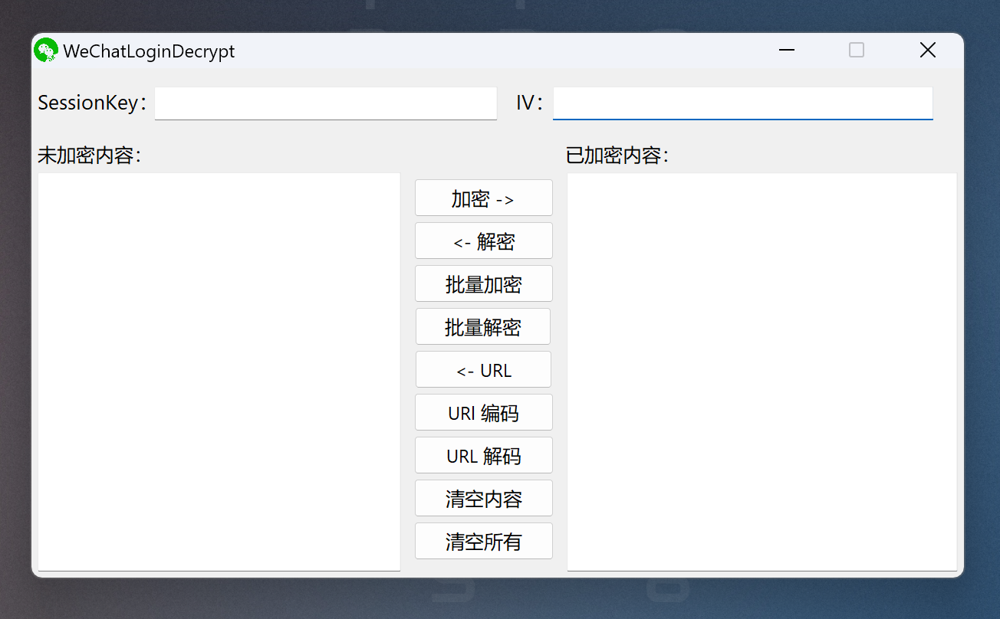

## WeChatLoginDecrypt

微信 SessionKey 加解密工具。

原本使用的是大佬通过 Python 和 Java 实现的工具，可是 QT 存在打开慢、高分辨率字体变糊，于是自己实现一个吧。

### 功能

#### AES 加解密

加密：
1. 输入 【SessionKey】 和 【IV】
2. 在 【未加密内容】 中输入需要加密的内容
3. 点击 【加密】 

解密：
1. 输入 【SessionKey】 和 【IV】
2. 在 【已加密内容】 中输入加密内容
3. 点击 【解密】 

#### 批量规则加解密

批量加密：
1. 输入 【SessionKey】 和 【IV】
2. 在 【未加密内容】 中输入你需要批量加密的内容，且指定一个 %% 参数
3. 在右侧 【已加密内容】 中用回车字符做分隔符，输入字典
4. 点击 【批量加密】 ，程序会将字典每一行替换掉 %%，并且进行加密操作

批量解密：
1. 输入 【SessionKey】 和 【IV】
2. 在 【已加密内容】 中输入加密内容，一行一个
3. 点击 【批量解密】 

#### URL 编码/解码

点击  【URL 编码】 按钮进行编码，点击  【URL 解码】 按钮进行解码。

你还可以点击 【<- URL】 【URL ->】 按钮指定编码/解码方向。

### 参考项目

[mrknow001/wx_sessionkey_decrypt/WX_login_crypt.py](https://github.com/mrknow001/wx_sessionkey_decrypt/blob/main/WX_login_crypt.py)

[mrknow001/BurpAppletPentester/Decryption.java](https://github.com/mrknow001/BurpAppletPentester/blob/main/src/main/java/crypto/Decryption.java)

感谢以上的大佬。
